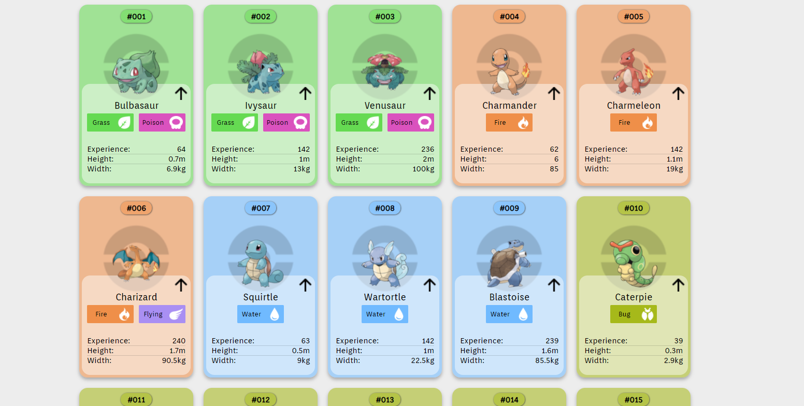
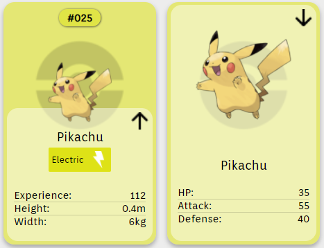

<h1 align="center">
	# PokeApi Project
</h1>

# About the project
O projeto consite na manipulação do PokeApi https://pokeapi.co/ na criação de cards com informações dos pokemons da primeira geração ordenados pelo id.

# Technologies
- ReactJs in class
- React Router DOM
- Axios
- Styled-components

#


<h1 align="center">
	
</h1>
<h1 align="center">
	Effect button
</h1>
<h1 align="center">
	
</h1>

Site Project - https://poke-api-six.vercel.app/


Requirements
- npm

**Clone the project and access the folder**

```bash
git clone https://github.com/DouglasANS/PokeApi.git 
```
&&
```bash
cd PokeApi
```

**Follow the steps below**

```bash
# Install the dependencies
$ npm install

# To finish, run the application
$ npm start

# Well done, project is started!
```
